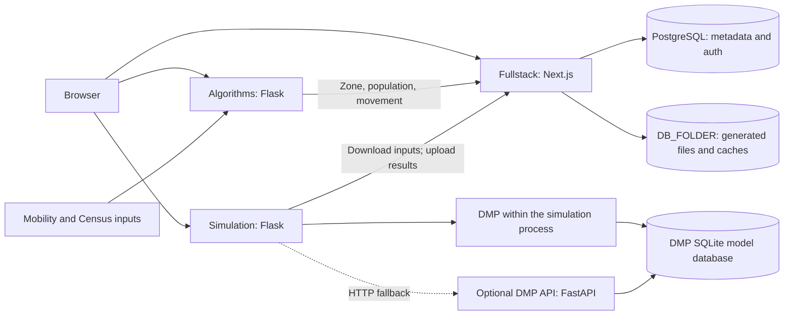

# Project overview

Delineo is a public-health modeling project associated with the Johns Hopkins
University Malone Center for Engineering in Healthcare. It lets users define a
community, create a synthetic population and movement schedule, simulate an
airborne outbreak under interventions, and inspect the resulting maps and charts.

This page describes the application in the [verified GitHub
revisions](verification.md). The [GitHub organization](https://github.com/Delineo-Disease-Modeling)
also contains earlier implementations and related research projects.

## Follow one simulation through the system

1. **Choose a study area.** The browser calls Algorithms to select and analyze
   census block groups (CBGs). Their combined study area is a *convenience zone*.
2. **Create people, homes, and places.** Algorithms combines population information
   and mobility data to generate synthetic residents, households, and points of
   interest (POIs).
3. **Generate movement.** Algorithms produces hourly assignments of people to
   homes and places. It uses the selected mobility data, visit timing, dwell,
   catchment, and opening-hours information. The generated population and movement
   are uploaded to Fullstack.
4. **Configure and run a scenario.** The browser sends the zone ID, run duration,
   initial infections, disease settings, and intervention timeline to Simulation.
   Simulation downloads the zone's inputs from Fullstack, applies transmission
   and disease progression, and streams progress to the browser.
5. **Store and inspect results.** Simulation uploads its output to Fullstack, which
   prepares chart and map caches. Users can play back the run, inspect individual
   movement and location statistics, save runs, compare scenarios, and export data.

The diagram shows service relationships, not a single proxy path. In local
development the browser contacts both Python services directly, so their public
URLs and CORS origins must agree with the frontend URL.

## Repositories and responsibilities

| Repository | Current role | Useful starting points |
| --- | --- | --- |
| [Fullstack](https://github.com/Delineo-Disease-Modeling/Fullstack) | Next.js App Router UI, Better Auth, Prisma/PostgreSQL, file storage, result processing | `src/app/`, `src/features/`, `src/server/`, `src/lib/`, `prisma/schema.prisma` |
| [Algorithms](https://github.com/Delineo-Disease-Modeling/Algorithms) | Flask API for zone analysis/generation; synthetic population and movement | `server/server.py`, `server/server_app/`, `server/czcode_modules/`, `server/popgen.py`, `server/patterns.py` |
| [Simulation](https://github.com/Delineo-Disease-Modeling/Simulation) | Flask simulation API, transmission engine, interventions, disease progression | `server.py`, `simulator/runner.py`, `simulator/infectionmgr.py`, `dmp/` |
| Deploy (private) | Maintainer launchers, Docker Compose, and deployment scripts | Public onboarding is documented in [Getting started](getting-started.md) |

`Fullstack` is one Next.js application. The older `Fullstack/client` and
`Fullstack/server` layout is not part of these revisions. Likewise, a directory
containing sibling clones is a workspace, not automatically a parent Git repository.

The organization's `Website` and `PandemicModel` repositories are earlier
implementations, not dependencies of this walkthrough. `Database` is archived;
the current application's database schema lives in Fullstack. The
[ai-counterfactual-analysis](https://github.com/Delineo-Disease-Modeling/ai-counterfactual-analysis)
repository is a related analysis project with its own setup; its compatibility
with these revisions is outside this milestone.

## What the models do

**Population and movement.** Algorithms constructs a synthetic population using
Census information and POI inputs, then generates location occupancy over time.
The current movement generator requires usable patterns data. Missing data raises
an error rather than producing an everyone-at-home fallback. Its default movement
scale is explicitly marked uncalibrated in the source.

**Transmission.** Simulation uses a Wells–Riley-based airborne-transmission model,
with household and POI occupancy and intervention settings. The runtime includes
an optimized array-based engine and fallback paths. Defaults and optional features
are defined in `simulator/config.py`; for example, external infection pressure is
disabled by default. A setting's presence in configuration does not mean every
engine path or UI workflow exercises it.

**Disease progression.** DMP provides state-machine-based progression timelines.
Simulation normally attempts to resolve these within its own process using the
bundled SQLite model database, with an HTTP fallback when needed. A separate API
on port 8000 is therefore optional for the normal in-process path. Runs support
`dmp_mode` values `auto`, `required`, and `off`: `auto` permits fallback behavior,
`required` surfaces missing progression models, and `off` uses the simulator's
default timelines. The frontend also supports supplied progression matrices.

The default scenario selects COVID-19 and Delta, while the request interfaces
allow other disease and variant inputs. Availability depends on the chosen model
data. Check the DMP API's `/diseases` and `/state-machines` responses instead of
assuming every disease mentioned in a template has a usable model.

Engineering checks establish that components can communicate and produce
consistent output formats. Scientific validation requires a separate, documented
comparison with observed data, including calibration, assumptions, and uncertainty.
The onboarding example does not make a forecasting or policy-validity claim.

## Where data lives

- **Source inputs:** Algorithms reads mobility files by state and month, compatible
  Census population tables, and 2016 TIGER/Line CBG geometry. These datasets are
  not supplied by cloning the public application repositories.
- **Application records:** PostgreSQL stores users, authentication records, zone
  metadata, run metadata, and custom DMP matrix records.
- **Generated payloads:** Fullstack's `DB_FOLDER` stores population, movement,
  simulation output, and map caches. File IDs connect them to PostgreSQL records.
  Population JSON is stored compressed; movement may use compressed JSON or the
  compact `DLNOPAT` binary format.
- **Progression models:** DMP's SQLite database lives at
  `Simulation/dmp/app/state_machine/state_machines.db`. It is distinct from the
  application's PostgreSQL database.

Backups or data transfers of the application need both its PostgreSQL records
and corresponding generated files. Model edits also require preserving the DMP
model database.

## Small glossary

| Term | Meaning here |
| --- | --- |
| CBG | Census block group, represented by a 12-digit GEOID string; preserve leading zeros |
| Convenience zone / CZ | The group of CBGs chosen as the simulation's study area |
| POI | Point of interest, such as a shop, workplace, or school |
| PAP / papdata | The bundle of synthetic people, homes, and places |
| Patterns | Time-indexed assignments of people to locations |
| DMP | Disease Modeling Platform, which supplies progression timelines |
| SSE | Server-sent events, used to stream progress and completion messages |

Zone lengths and `gen_patterns` durations are in **hours**. Simulation request
`length`, intervention `time`, and movement timestamp keys are in **minutes**.
The synthetic example makes this conversion explicit.

Continue with [Getting started](getting-started.md).
